# Visualizing bigWig signal

`wigglescout` provides a set of out-of-the-box functions to visualize
bigWig values genome-wide or on a defined set of loci:

- `plot_bw_bins_scatter`. A genome-wide bin-based scatterplot. Needs
  `genome` and `bin_size` parameters.
- `plot_bw_loci_scatter`. A locus-based scatterplot. Needs a `loci` file
  or `GRanges` object.
- `plot_bw_bins_violin`. A genome-wide bin-based violinplot. Needs
  `genome` and `bin_size` parameters.
- `plot_bw_loci_summary_heatmap`. Summarized heatmap over a categorized
  BED file. This works great with annotations like ChromHMM, but other
  BED files can be used, as long as their name field is meaningful
  (provides a category). An example could be a `genes.bed` file where
  genes are labelled according to expression, low, med, high.
- `plot_bw_profile`. A profile plot over a set of loci.
- `plot_bw_heatmap`. A per-locus heatmap.

As you may have noticed, `loci` functions take as parameter a `loci`
value, which can be a BED file or a `GRanges` object. If you provide a
`GRanges` object, chances are that you need to provide a `label`, as
there is no way to infer this from the `GRanges` object. On the other
hand, whenever bigWig or BED files are provided, they are labeled by
default with their names.

You can find more detailed information about these below.

## Genome-wide plots

Bin-based genome-wide analysis is currently supported in two formats:

- `plot_bw_bins_violin`. Makes a violin plot of one or more bigWig
  files.
- `plot_bw_bins_scatter`. Makes a scatter plot of two different bigWig
  files against each other.

Both plot types allow for background bigWig signal to be provided
(i.e. input).

### Violin plots

For a set of bigWig files, it is possible to visualize the genome-wide
signal distribution. For example:

``` r
plot_bw_bins_violin(h33_chip, bin_size = 2000, selection = locus)
```

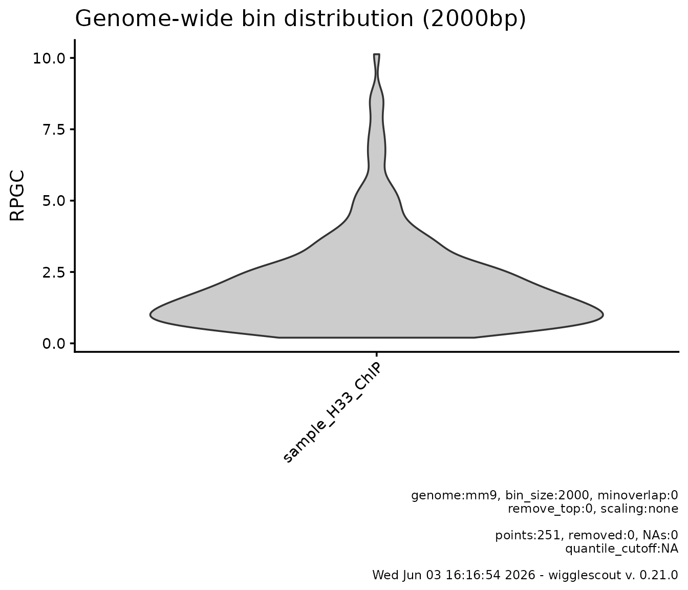

Note that `bin_size` parameter influences the time any of these
functions take to run. Reasonable resolution for this is 5000 or 10000.

It is possible to plot several bigWig files at a time:

``` r
plot_bw_bins_violin(c(h33_chip, input_chip), bin_size = 2000, selection = locus)
```

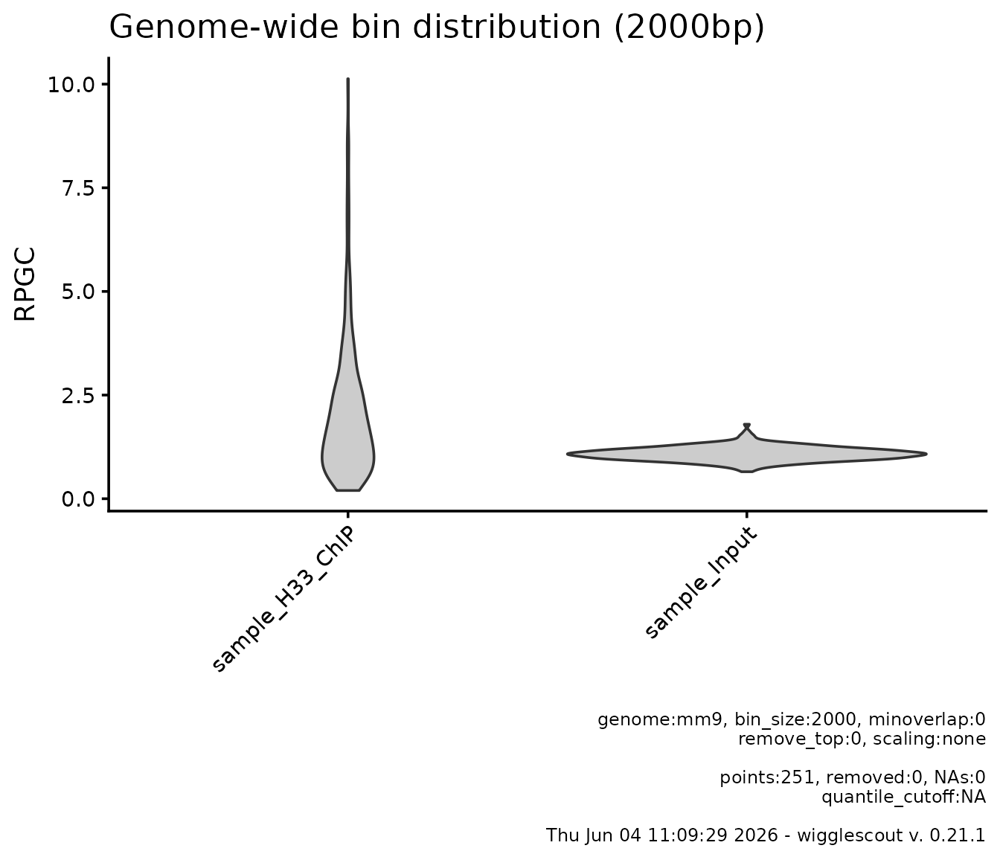

Additionally, one can highlight bins that overlap with a certain set of
interest loci. This is done via the `highlight` parameter:

``` r
plot_bw_bins_violin(
  c(h33_chip, input_chip),
  bin_size = 2000,
  highlight = genes,
  highlight_color = c("red", "red"), # It is possible to provide different colors
  selection = locus
)
```

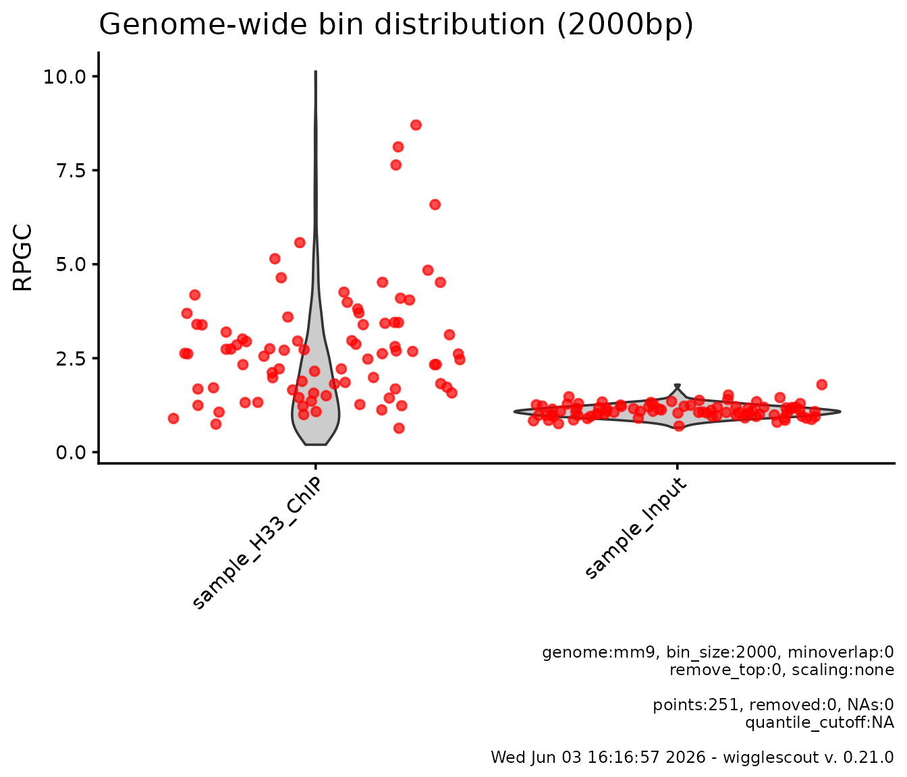

It is also possible to provide a list of bigWig files to be used as
background to normalize the bin values to. For instance, in the previous
case, one could want to use the input values to normalize the H3.3 ChIP
data:

``` r
# bg_bwfiles parameter is set now to input_chip
plot_bw_bins_violin(
  h33_chip, 
  bg_bwfiles = input_chip,
  bin_size = 2000,
  highlight = genes,
  highlight_color = c("red"),
  selection = locus
)
```

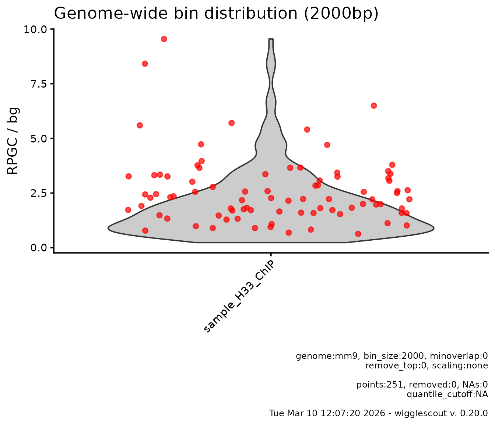

If `norm_mode` is provided, it is possible to log-transform these values
as well:

``` r
# bg_bwfiles parameter is set now to input_chip
plot_bw_bins_violin(
  h33_chip, 
  bg_bwfiles = input_chip,
  bin_size = 2000,
  highlight = genes,
  highlight_color = c("#000088"), # Colors can be also HTML codes
  norm_mode = "log2fc",
  selection = locus
)
```

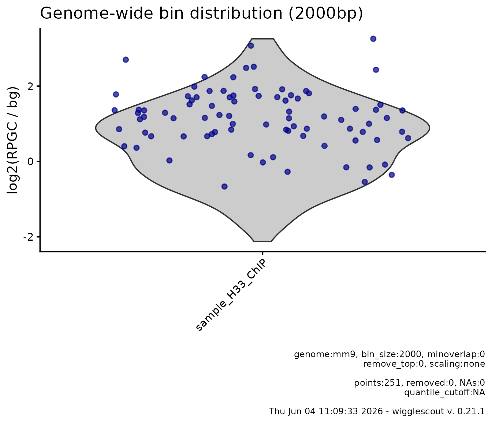

### Genome-wide scatterplots

You can compare two signals against each other on a scatter plot. To do
so, you can use `plot_bw_bins_scatter`. This function works very
similarly to `plot_bw_bins_violin` but instead of accepting an array of
bigWig files, it accepts separate `x` and `y` parameters and the
corresponding optional `bg_x` and `bg_y`, `norm_mode_x`, `norm_mode_y`.
You can see more details in the function documentation.

One example would be looking at H3.3 versus H3K9me3 in this sample data:

``` r
plot_bw_bins_scatter(
  x = h33_chip,
  y = h3k9me3_chip,
  bin_size = 2000,
  selection = locus
)
```

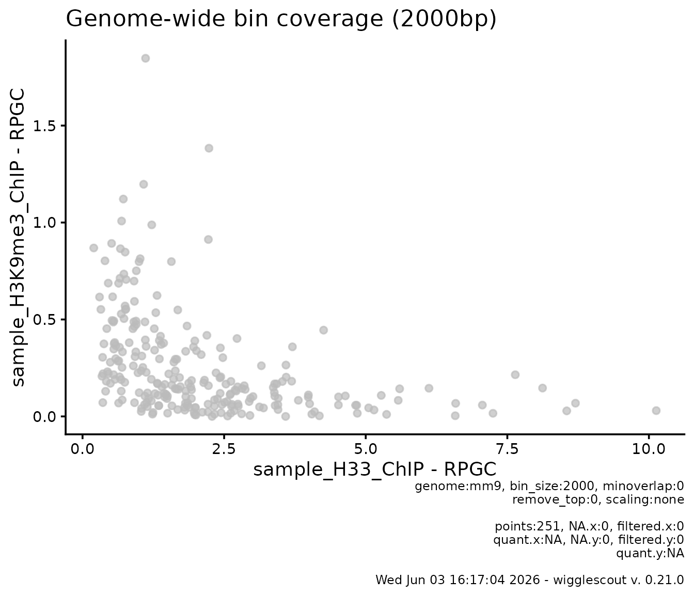

This is useful to see relationships between marks. In this case, bins
where H3.3 signal is high, H3K9me3 signal is low and viceversa.

The same way as with `plot_bw_bins_violin`, it is possible to specify a
set of loci to highlight within the bins, and normalize to given
signals:

``` r
plot_bw_bins_scatter(
  x = h33_chip,
  bg_x = input_chip,
  y = h3k9me3_chip,
  bg_y = input_chip,
  bin_size = 2000,
  highlight = genes,
  highlight_colors = "red",
  highlight_label = "genes", # It is also possible to label the groups
  norm_mode_x = "log2fc", # Each norm mode is provided separately
  selection = locus
)
```

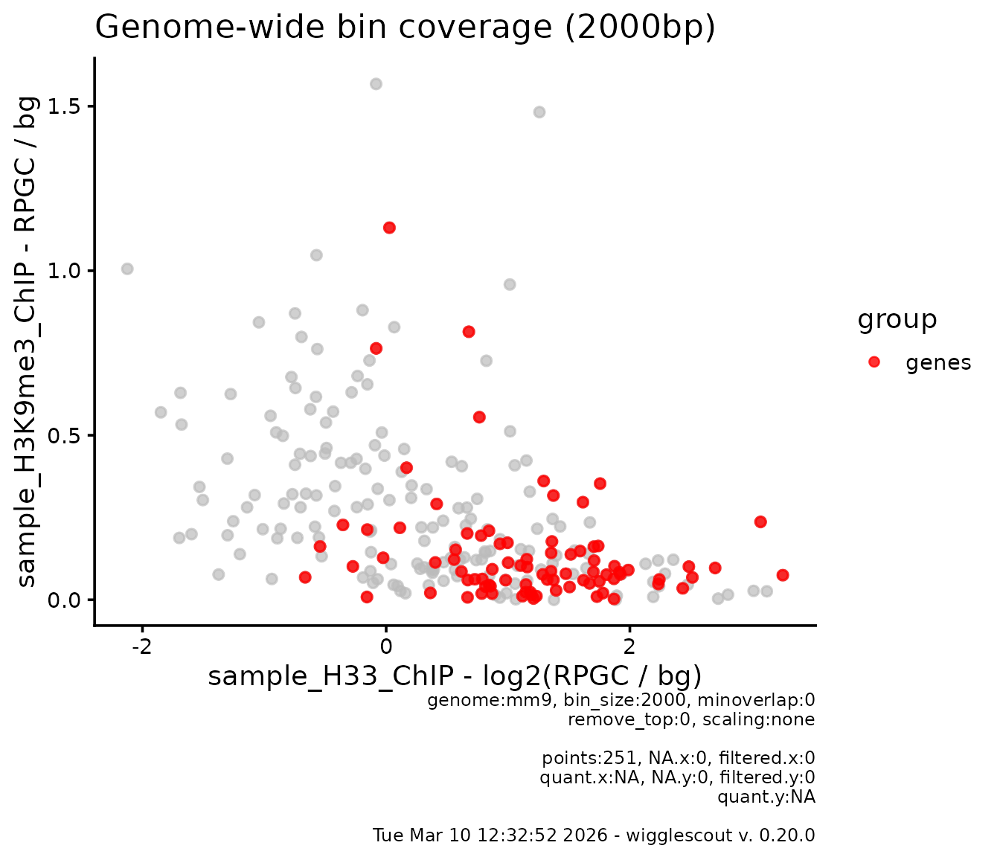

## Locus-specific plots

It is also possible to look at the ChIP data in a more specific way. For
this, `elsasserlib` provides the following functions:

- `plot_bw_bed_summary_heatmap`: Summarizes the values across a BED
  file, using name field as category.
- `plot_bw_profile`: Creates a profile plot across a set of loci.
- `plot_bw_heatmap`: Creates a heatmap across a set of loci.

### Summary heatmaps

These plots are meant to provide a genome-wide overview of the signal
across different biologically-relevant categories. They get a list of
bigWig files and a BED file as input. Each bigWig file will represent a
row in the heatmap, and each cell will be an aggregate value of the
corresponding bigWig file in a given category in the BED file, for
example:

``` r
# ChromHMM is a genome-wide annotation according to epigenetics marks. Each
# locus is tagged by a category. And the amount of categories must be limited.
# In this case, it is fifteen. 
chrom_values <- import(chromhmm, format = "BED")
head(chrom_values)
#> GRanges object with 6 ranges and 2 metadata columns:
#>       seqnames              ranges strand |           name     score
#>          <Rle>           <IRanges>  <Rle> |    <character> <numeric>
#>   [1]    chr15 102602601-102606600      * | 12_Heterochrom         0
#>   [2]    chr15 102606601-102607600      * |   11_Repressed         0
#>   [3]    chr15 102615401-102615800      * |   15_Insulator         0
#>   [4]    chr15 102615801-102616800      * |   11_Repressed         0
#>   [5]    chr15 102616801-102626600      * | 12_Heterochrom         0
#>   [6]    chr15 102626601-102627600      * |   11_Repressed         0
#>   -------
#>   seqinfo: 1 sequence from an unspecified genome; no seqlengths

plot_bw_loci_summary_heatmap(
  c(h33_chip, h3k9me3_chip),
  loci = chromhmm,
  labels = c("H33", "H3K9me3")
)
```

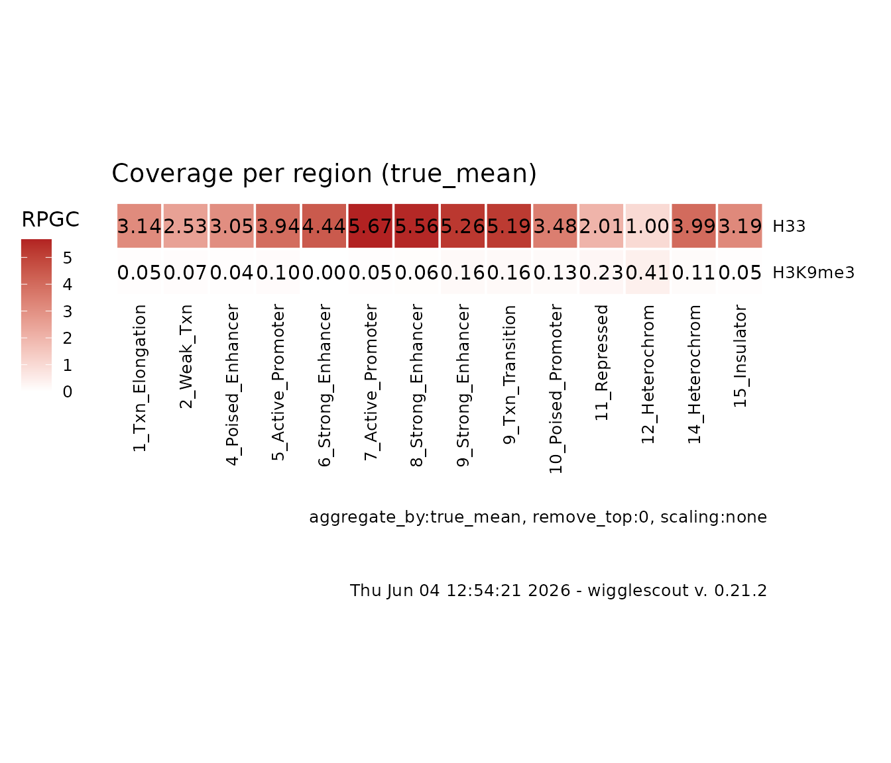

Since this example is reduced to a set of HOXC genes, you can see how
H3.3 signal is high and H3K9me3 is generally low.

It is possible as in the previous types of plots to provide bigWig files
as normalization / input tracks and use them in the same way as before:

``` r
plot_bw_loci_summary_heatmap(
  c(h33_chip, h3k9me3_chip),
  bg_bwfiles = c(input_chip, input_chip),
  loci = chromhmm,
  labels = c("H33", "H3K9me3")
)
```

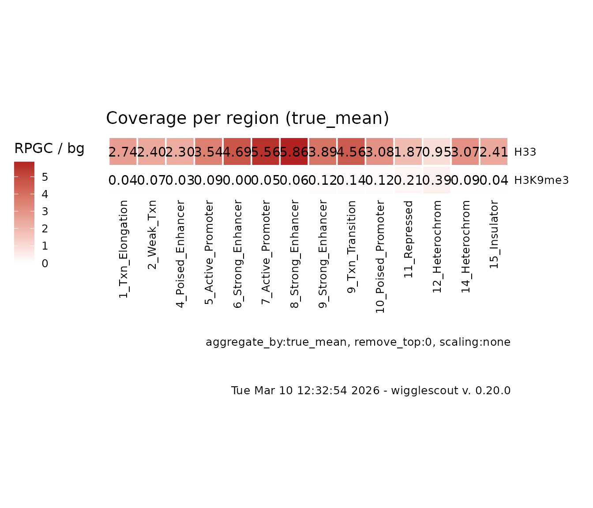

#### How the values are aggregated

Since this function is aggregating the values, it is possible to specify
the way the per-locus values are aggregated. Default is **true mean**.
What it means is that all the coverage values are binned together and
the mean is performed as if each category is one big locus. Another
possibilities are: **mean of means** (`aggregate_by = "mean"`), which
will calculate mean coverage per locus and then the aggregate value will
be the mean of those mean values, and **median of means**
(`aggregate_by = "median"`). Median per-locus coverage values tend to be
noisy, so a median of means could be useful in some cases.

``` r
plot_bw_loci_summary_heatmap(
  c(h33_chip, h3k9me3_chip),
  bg_bwfiles = c(input_chip, input_chip),
  loci = chromhmm,,
  labels = c("H33", "H3K9me3"),
  aggregate_by = "median"   # Note this is a string value, not a function
)
```

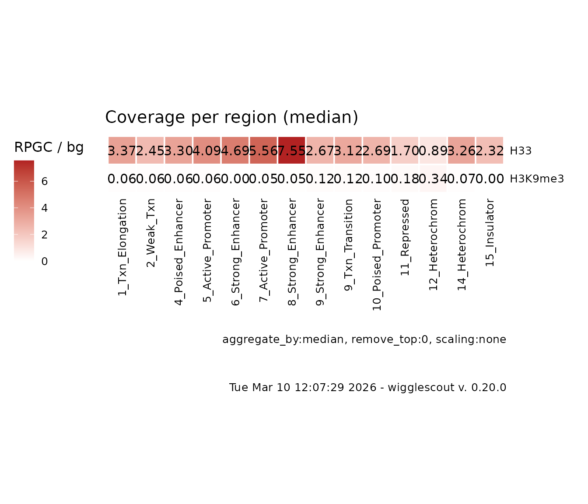

### Profile plots

Another way to look at how the ChIP data looks is to summarize a profile
across a set of *loci*. In order to do that you can use the
`plot_bw_profile` function:

``` r
plot_bw_profile(
  c(h33_chip, h3k9me3_chip, input_chip),
  loci = genes,
  labels = c("H3.3", "H3K9me3", "Input")
)
```

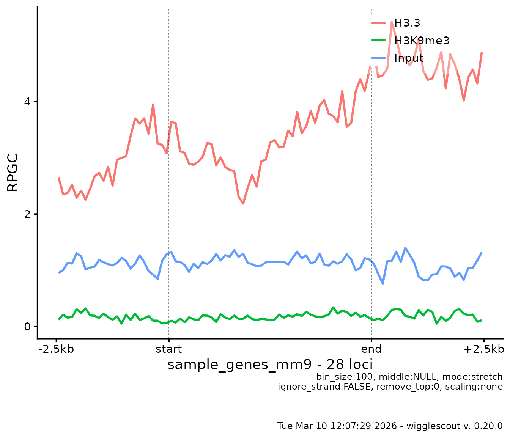

The default mode is called `stretch`, where start (3’ end) and end (5’
end) of *loci* are aligned and the length of the *locus* is stretched to
a given pseudolength (`middle` parameter). If this parameter is not
given, the pseudolength will be assigned as the median value of the
length distribution of *loci*, in an attempt to match a realistic
length.

It is possible to align only 3’ ends, 5’ ends or center of loci,
similarly to what formatting text alignment would do:

``` r
plot_bw_profile(
  c(h33_chip, h3k9me3_chip, input_chip),
  loci = genes,
  labels = c("H3.3", "H3K9me3", "Input"),
  mode = "start"
)
```

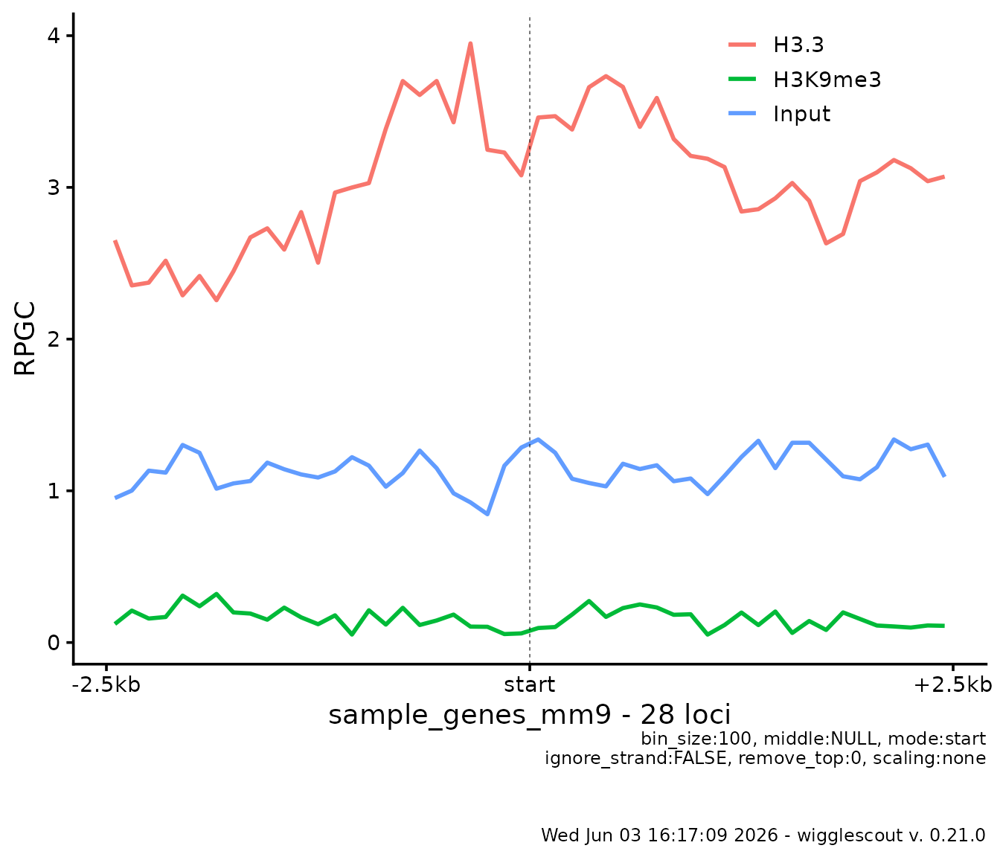

It is also possible to specify the upstream and downstream lengths:

``` r
plot_bw_profile(
  c(h33_chip, h3k9me3_chip, input_chip),
  loci = genes,
  labels = c("H3.3", "H3K9me3", "Input"),
  mode = "center",
  upstream = 3000,
  downstream = 3000
)
```

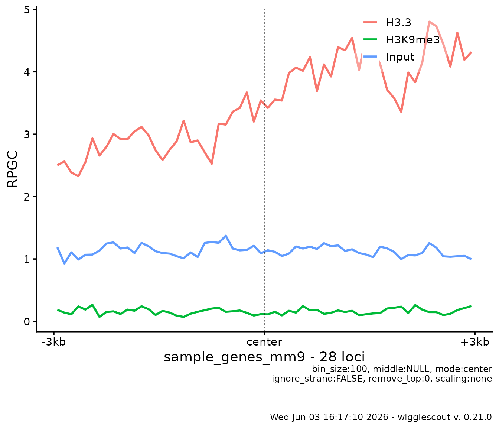

``` r
plot_bw_profile(
  c(h33_chip, h3k9me3_chip, input_chip),
  loci = genes,
  labels = c("H3.3", "H3K9me3", "Input"),
  mode = "end",
  upstream = 7000,
  downstream = 3000,
  show_error = TRUE # Turn error estimates on
)
```

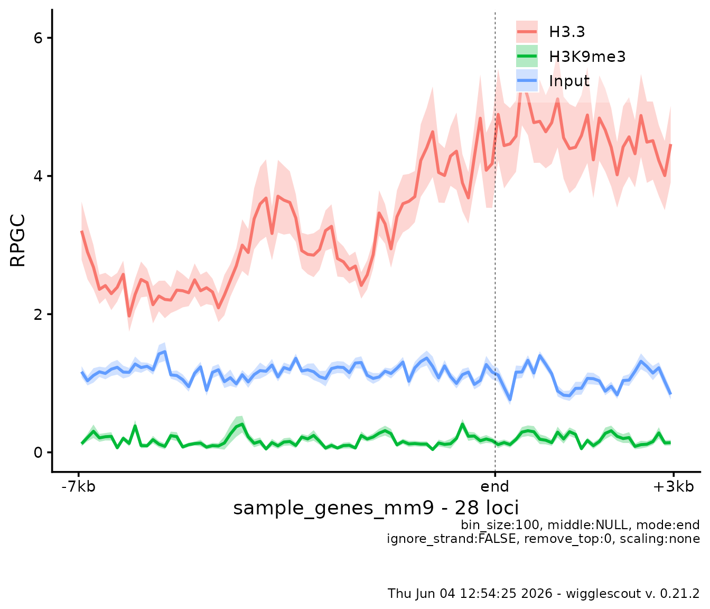

### Heatmaps

Finally, it is possible to look at the profile across a set of *loci* in
a per-*locus* way by looking at heatmaps.

``` r
plot_bw_heatmap(
  h33_chip,
  loci = genes
)
```

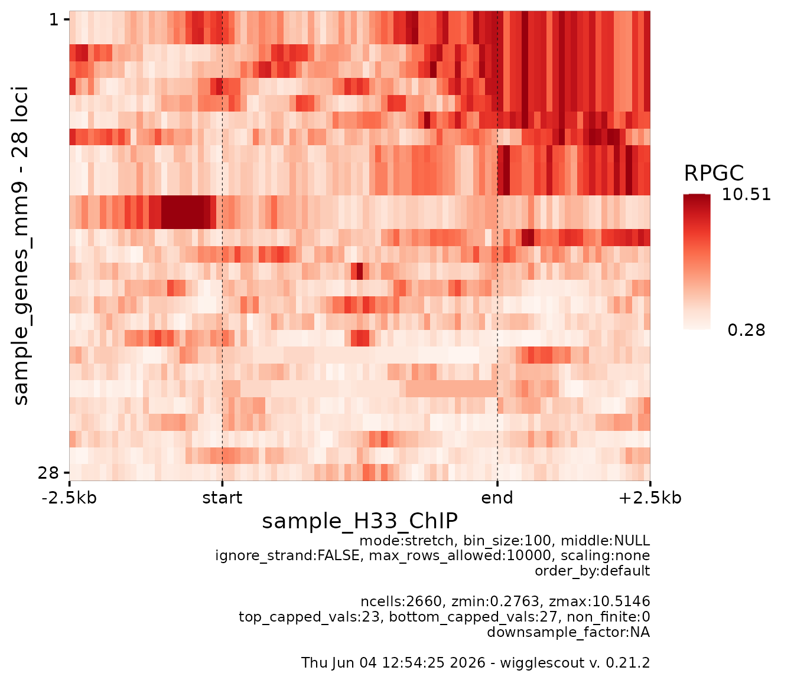

This gene annotation includes some variants of the same genes that
overlap a lot, so some of the rows look very similar or even like
duplicates.

Most of the parameters are shared between `plot_bw_profile` and
`plot_bw_heatmap` making it possible to arrange them on top of each
other later on, so it is possible to align them in different ways:

``` r
plot_bw_heatmap(
  h33_chip,
  loci = genes,
  mode = "start",
  upstream = 2500,
  downstream = 2500
)
```

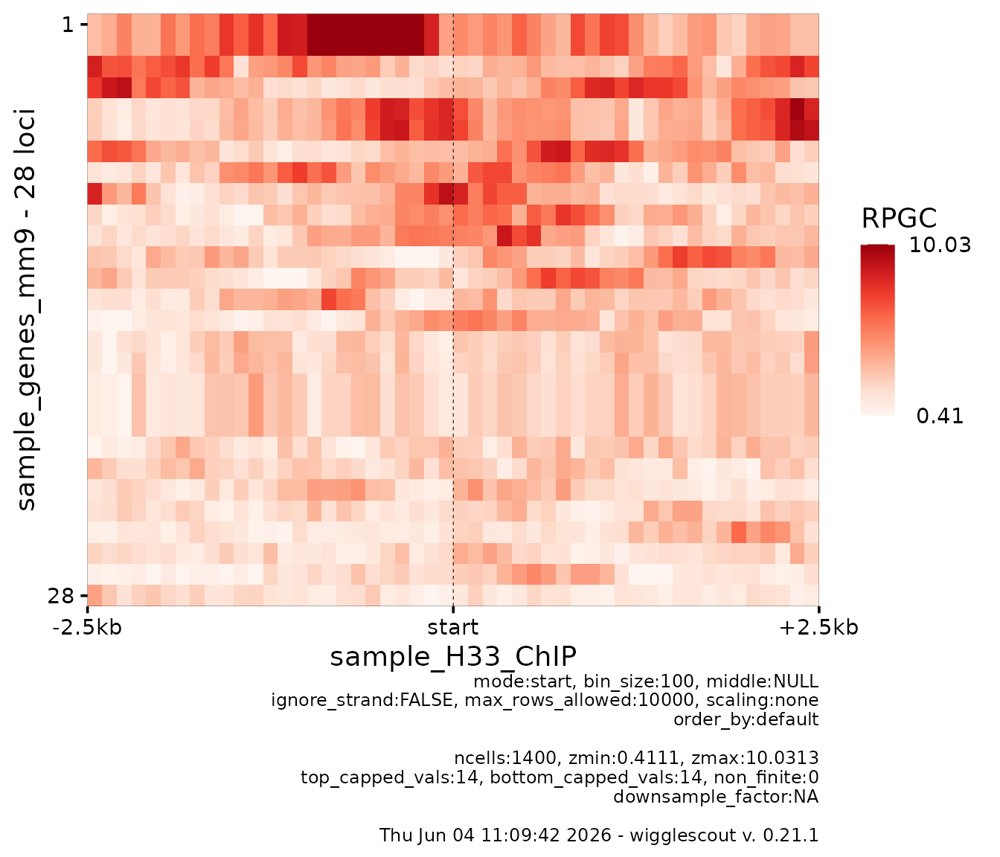

It is possible to specify `bin_size` to increase or decrease resolution
(this can also be done on profile plots):

``` r
plot_bw_heatmap(
  h33_chip,
  loci = genes,
  mode = "start",
  upstream = 2500,
  downstream = 2500,
  bin_size = 20
)
```

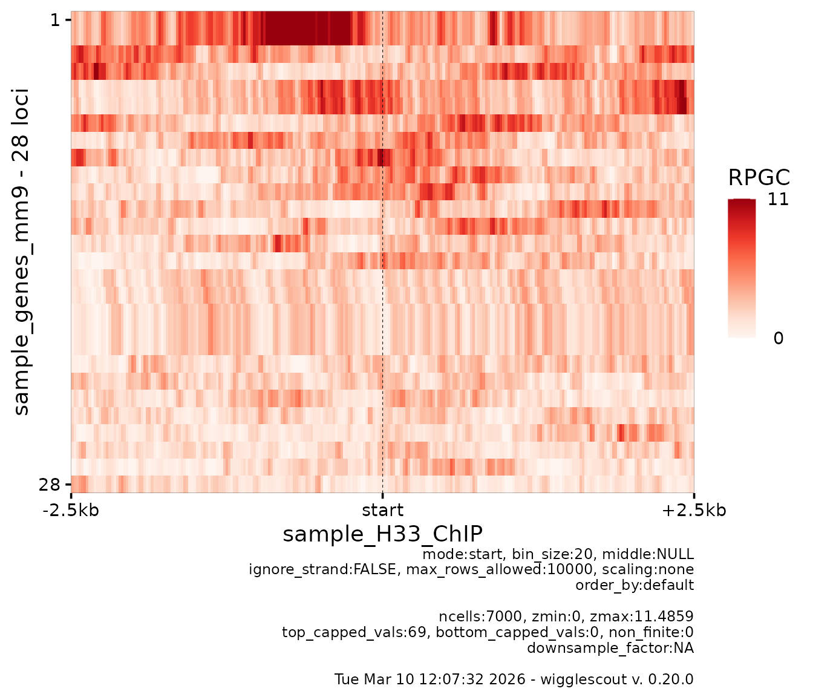

At this point, heatmap values are shown in order from maximum mean value
across all the beans to lowest.

By default, colorscale is set to percentiles 0.01 and 0.99 of whole
matrix range. You can set these values to fixed numbers. This is useful
mostly to plot together several heatmaps with the same color scale. For
example:

``` r
plot_bw_heatmap(
  h33_chip,
  loci = genes,
  mode = "start",
  upstream = 2500,
  downstream = 2500,
  bin_size = 100,
  zmin = 2,
  zmax = 10
)
```

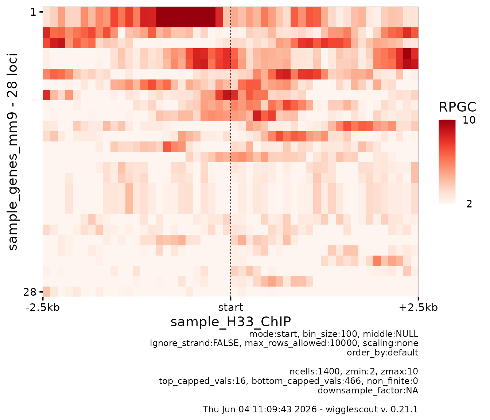

It is also possible to change the color of the heatmap using any
`RColorBrewer` available palette:

``` r
plot_bw_heatmap(
  h33_chip,
  loci = genes,
  bin_size = 100,
  cmap = "RdYlBu"
)
```

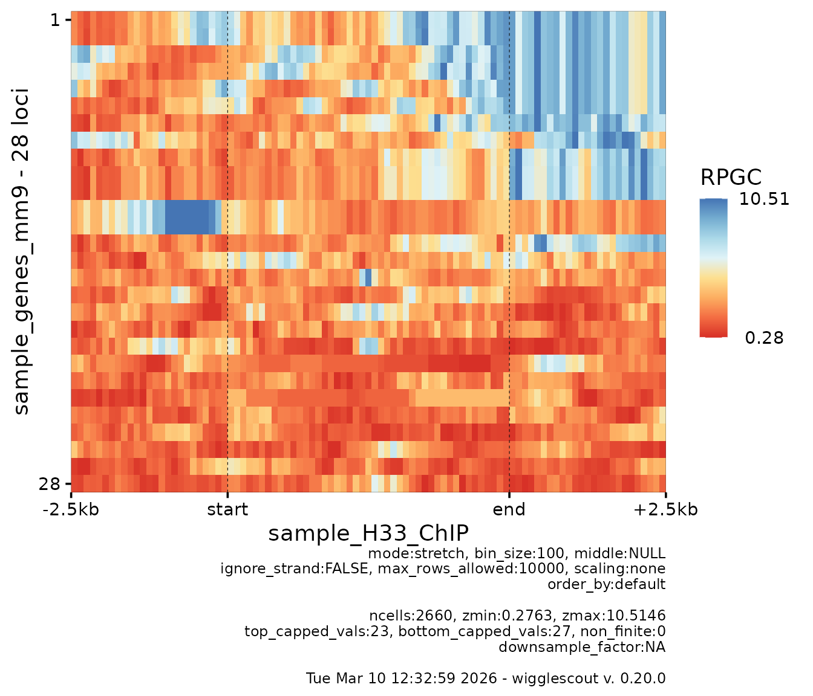

There is also a `max_rows_allowed` parameter that defaults to 10000.
This allows to plot large matrices by binning vertically the heatmap and
plotting the underlying mean associated, provided that a screen or a
reasonable screen will not be able to display all the data points
anyway. If the number of rows is larger than `max_rows_allowed`, rows
will be binned in a way that the resulting plotted matrix will have
`max_rows_allowed` height and a warning will be shown. Since the matrix
is not subsampled only, but the underlying values averaged, this may
result in a smoothened effect in the image. This is a similar approach
to how image resizing works.

## Plotting signal over precalculated GRanges

It is possible to plot the values already calculated in a `GRanges`
object by specifying the metadata columns used. Essentially, anything
calculated by `bw_loci` and `bw_bins` functions can be passed to
`plot_gr` functions:

- `plot_gr_violin`. Makes a violin plot of one or more columns of a
  `GRanges` object.
- `plot_gr_scatter`. Makes a scatter plot of two different columns.
- `plot_gr_density`. Makes a 2d histogram plot of two different columns.

``` r
gr <- bw_bins(
  c(h33_chip, h3k9me3_chip),
  bin_size = 2000,
  genome = "mm9",
  labels = c("H33", "H3K9me3"),
  selection = locus
)

plot_gr_scatter(gr, 
  x = "H33",
  y = "H3K9me3",
  remove_top = 0.001
)
```

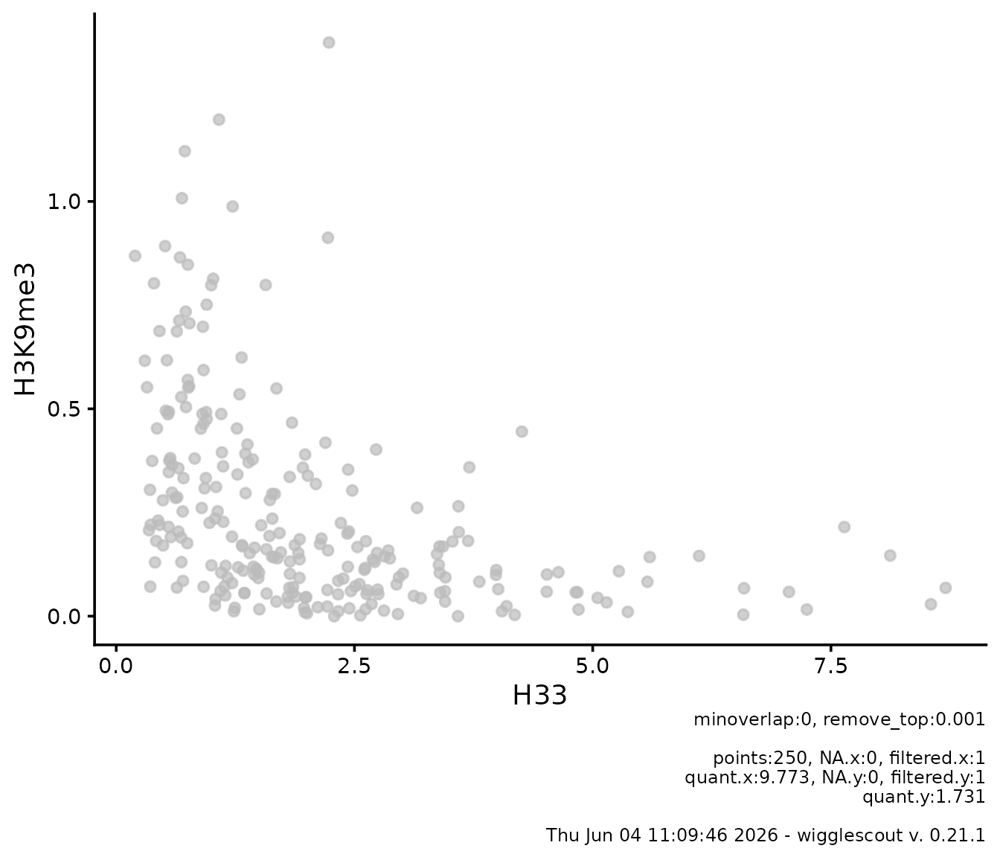

This is useful if you are doing many pairwise combinations of figures,
or you want to do custom calculations on the bigWig values, especially
if the bin size is small and you are working with a large amount of data
points.

## Customizing plots

All plotting functions return a `ggplot` object. This means that
essentially you can overlay any other data you want or further customize
the results. For example:

``` r
profile_plot <- plot_bw_profile(
  c(h33_chip, h3k9me3_chip, input_chip),
  loci = genes
)

profile_plot + 
  ggtitle("New title for the plot") + # Add a custom title
  geom_hline(yintercept = 1, linetype="dashed") # Add a horizontal line on y=1
```

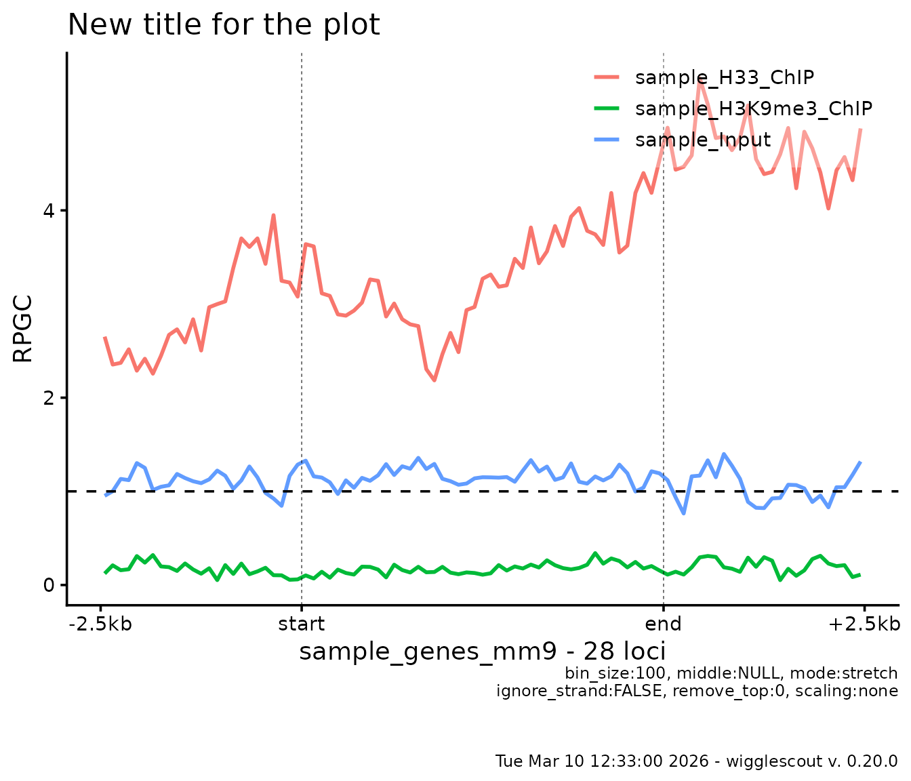

``` r
sessionInfo()
#> R version 4.5.2 (2025-10-31)
#> Platform: x86_64-pc-linux-gnu
#> Running under: Ubuntu 24.04.3 LTS
#> 
#> Matrix products: default
#> BLAS:   /usr/lib/x86_64-linux-gnu/openblas-pthread/libblas.so.3 
#> LAPACK: /usr/lib/x86_64-linux-gnu/openblas-pthread/libopenblasp-r0.3.26.so;  LAPACK version 3.12.0
#> 
#> locale:
#>  [1] LC_CTYPE=C.UTF-8       LC_NUMERIC=C           LC_TIME=C.UTF-8       
#>  [4] LC_COLLATE=C.UTF-8     LC_MONETARY=C.UTF-8    LC_MESSAGES=C.UTF-8   
#>  [7] LC_PAPER=C.UTF-8       LC_NAME=C              LC_ADDRESS=C          
#> [10] LC_TELEPHONE=C         LC_MEASUREMENT=C.UTF-8 LC_IDENTIFICATION=C   
#> 
#> time zone: UTC
#> tzcode source: system (glibc)
#> 
#> attached base packages:
#> [1] stats4    stats     graphics  grDevices utils     datasets  methods  
#> [8] base     
#> 
#> other attached packages:
#> [1] wigglescout_0.20.0   rtracklayer_1.70.1   GenomicRanges_1.62.1
#> [4] Seqinfo_1.0.0        IRanges_2.44.0       S4Vectors_0.48.0    
#> [7] BiocGenerics_0.56.0  generics_0.1.4       ggplot2_4.0.2       
#> 
#> loaded via a namespace (and not attached):
#>  [1] SummarizedExperiment_1.40.0 beeswarm_0.4.0             
#>  [3] gtable_0.3.6                rjson_0.2.23               
#>  [5] xfun_0.56                   bslib_0.10.0               
#>  [7] Biobase_2.70.0              lattice_0.22-7             
#>  [9] Cairo_1.7-0                 vctrs_0.7.1                
#> [11] tools_4.5.2                 bitops_1.0-9               
#> [13] curl_7.0.0                  parallel_4.5.2             
#> [15] tibble_3.3.1                pkgconfig_2.0.3            
#> [17] Matrix_1.7-4                RColorBrewer_1.1-3         
#> [19] cigarillo_1.0.0             S7_0.2.1                   
#> [21] desc_1.4.3                  lifecycle_1.0.5            
#> [23] stringr_1.6.0               compiler_4.5.2             
#> [25] farver_2.1.2                Rsamtools_2.26.0           
#> [27] textshaping_1.0.5           Biostrings_2.78.0          
#> [29] codetools_0.2-20            vipor_0.4.7                
#> [31] GenomeInfoDb_1.46.2         htmltools_0.5.9            
#> [33] sass_0.4.10                 RCurl_1.98-1.17            
#> [35] yaml_2.3.12                 tidyr_1.3.2                
#> [37] pillar_1.11.1               pkgdown_2.2.0              
#> [39] crayon_1.5.3                jquerylib_0.1.4            
#> [41] BiocParallel_1.44.0         cachem_1.1.0               
#> [43] DelayedArray_0.36.0         abind_1.4-8                
#> [45] tidyselect_1.2.1            digest_0.6.39              
#> [47] stringi_1.8.7               purrr_1.2.1                
#> [49] dplyr_1.2.0                 restfulr_0.0.16            
#> [51] labeling_0.4.3              fastmap_1.2.0              
#> [53] grid_4.5.2                  SparseArray_1.10.9         
#> [55] cli_3.6.5                   magrittr_2.0.4             
#> [57] S4Arrays_1.10.1             XML_3.99-0.22              
#> [59] withr_3.0.2                 UCSC.utils_1.6.1           
#> [61] scales_1.4.0                ggbeeswarm_0.7.3           
#> [63] rmarkdown_2.30              XVector_0.50.0             
#> [65] httr_1.4.8                  matrixStats_1.5.0          
#> [67] ragg_1.5.1                  evaluate_1.0.5             
#> [69] ggrastr_1.0.2               knitr_1.51                 
#> [71] BiocIO_1.20.0               rlang_1.1.7                
#> [73] glue_1.8.0                  jsonlite_2.0.0             
#> [75] R6_2.6.1                    MatrixGenerics_1.22.0      
#> [77] GenomicAlignments_1.46.0    systemfonts_1.3.2          
#> [79] fs_1.6.7
```
