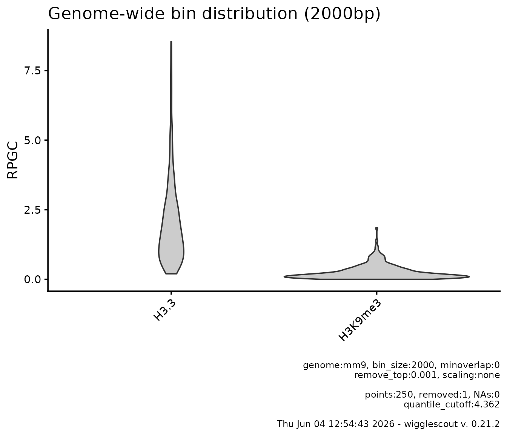
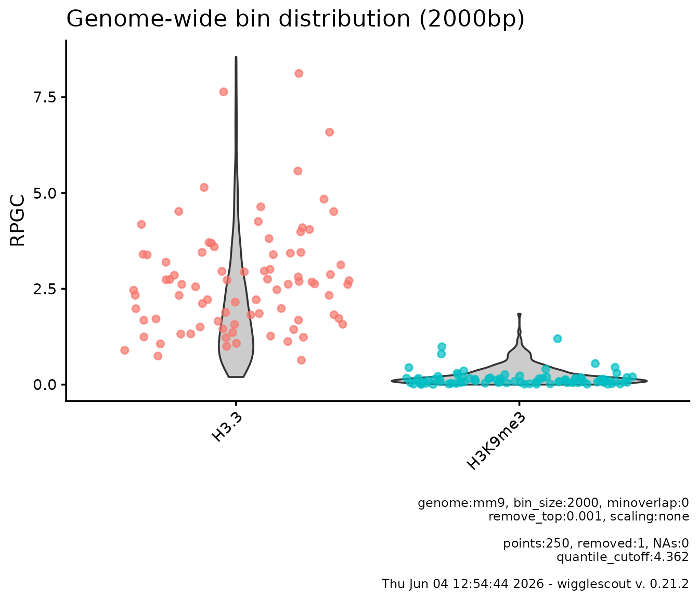
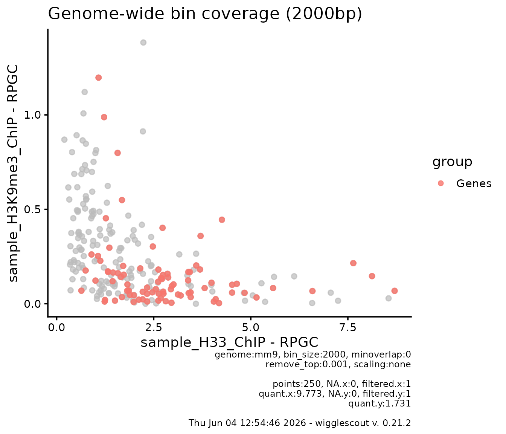
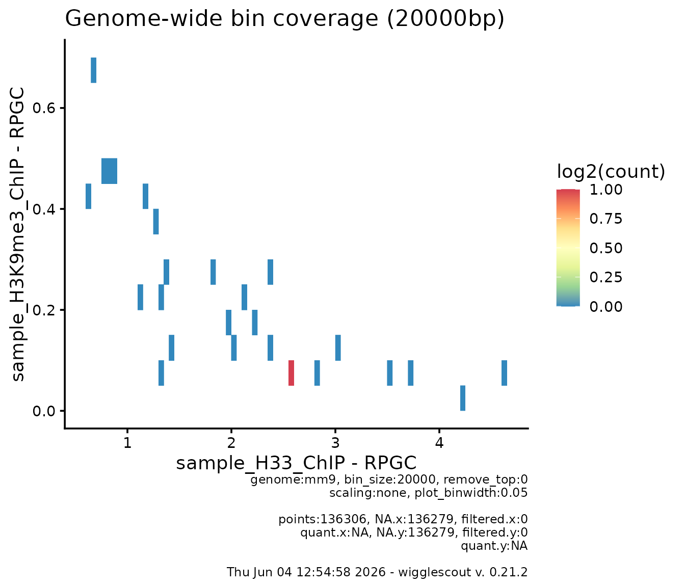
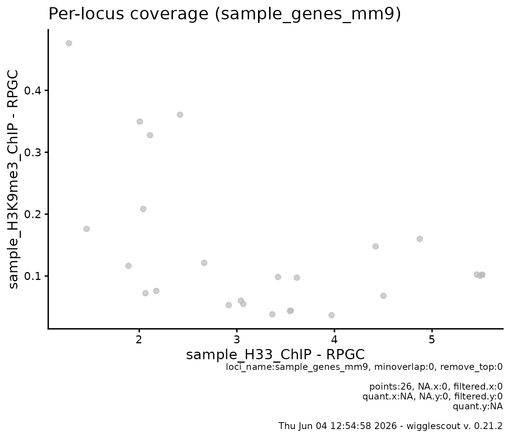
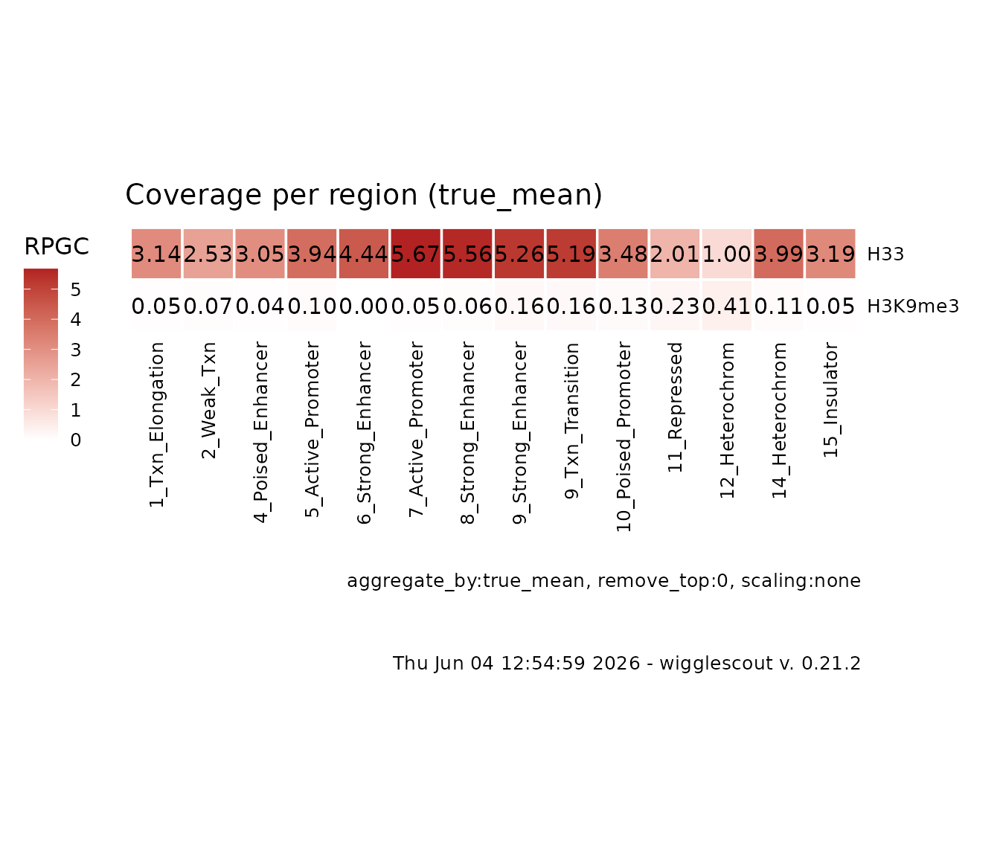
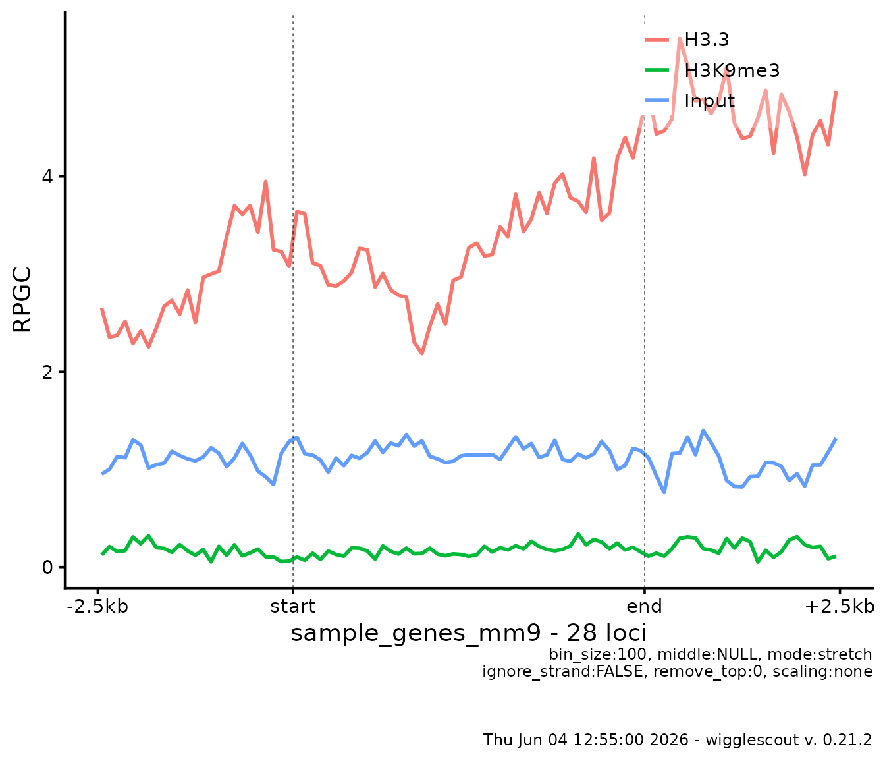
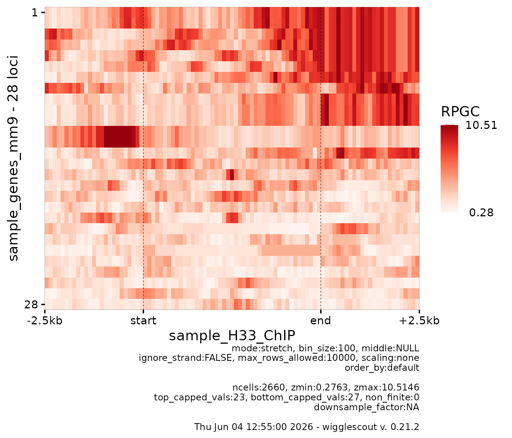

# Wigglescout

## Summary and scope

`wigglescout` is an R library that allows you to calculate summary
values across bigWig files and BED files and visualize them in a
genomics-relevant manner. It is based on broadly used libraries such as
`rtracklayer` and `GenomicRanges`, among others for calculation, and
mostly `ggplot2` for visualization. You can look at the `DESCRIPTION`
file to get more information about all the libraries that make this one
possible.

There are also many other tools whose functionality overlaps a little or
much with `wigglescout`, but there was no single tool that included all
that I needed. The aim of this library is therefore not to replace any
of those tools, or to provide a silver-bullet solution to genomics data
analysis, but to provide a comprehensive, yet simple enough set of tools
focused on bigWig files that can be used entirely from the R environment
without switching back and forth across environments.

Other tools and libraries for akin purposes that you may be looking for
include: deepTools, SeqPlots, bwtools, wiggletools, and the list is
endless!

`wigglescout` allows you to summarize and visualize the contents of
bigWig files in two main ways:

- **Genome-wide**. Genome is partitioned on equally-sized bins and their
  aggregated value is calculated. Useful to get a general idea of the
  signal distribution without looking at specific places.
- **Across sets of *loci***. This can be either summarized categories,
  or individual values, as in genome-wide analyses.

`wigglescout` functionality is built in two layers. Names of functions
that calculate values over bigWig files start with `bw_`. These return
`GRanges` objects when possible, `data.frame` objects otherwise
(i.e. when values are summarized over some category, genomic location is
lost in this process).

On the other hand, functions that plot such values and that usually make
internal use of `bw_` functions, start with `plot_`.

## About bundled data

This package comes with a set of small files to show functionality.
These have been built from a published data from Simon Elsässer’s lab
and correspond to a H3.3 and H3K9me3 ChIP + input (`GSE149080`), subset
across a 500kbp genomic region: `chr15-102600000-103100000`, which
overlaps with the *HOXC* gene cluster. A ChromHMM annotation has also
been subset to overlap with such region.

``` r

library(ggplot2)
library(rtracklayer)
library(GenomicRanges)
library(wigglescout)

h33_chip <- system.file("extdata", "sample_H33_ChIP.bw", package = "wigglescout")
h3k9me3_chip <- system.file("extdata", "sample_H3K9me3_ChIP.bw", package = "wigglescout")
input_chip <- system.file("extdata", "sample_Input.bw", package = "wigglescout")
genes <- system.file("extdata", "sample_genes_mm9.bed", package = "wigglescout")
chromhmm <- system.file("extdata", "sample_chromhmm.bed", package = "wigglescout")

locus <- GRanges(seqnames = "chr15", IRanges(102600000, 103100000))
```

All these values are paths to bigWig and BED files.

## Quick start

Here is a small example of what you can do with `wigglescout`. Imagine
you want to take a look at how values are distributed overall in your
bigwig files, genome-wide:

``` r

plot_bw_bins_violin(
  c(h33_chip, h3k9me3_chip),
  bin_size = 2000,
  labels = c("H3.3", "H3K9me3"),
  remove_top = 0.001,
  selection = locus # Plot can be subset to a certain GRanges.
)
```



For transparency and reproducibility, plots show relevant underlying
values by default, such as parameters used and calculated values: how
many `NA` values were found, if any, how many points were excluded from
the plot due to quantile cutoff, and so on. Note also that in this case
the quantile cutoff seems low, but it is because top elements are
removed according to mean in all samples.

Note also that the bin size chosen, `2000` is somewhat small for
genome-wide analyses (it will take long runtime, see the “Performance
and runtime” section at the end of the document for more details), but
it can be done in this case due to the use of `selection` parameter,
which restricts the bin analysis to a certain locus.

You could also be interested in checking out how are certain *loci*
behaving in comparison with the global distribution. You can do so
providing a `highlight` parameter:

``` r

plot_bw_bins_violin(
  c(h33_chip, h3k9me3_chip),
  bin_size = 2000,
  labels = c("H3.3", "H3K9me3"),
  remove_top = 0.001,
  highlight = genes,
  selection = locus # Plot can be subset to a certain GRanges.
)
```



Here you see highlighted the bins that overlap with the loci in the
`genes` file.

You could also want to pairwise compare the bins. You can do so by
plotting a scatterplot:

``` r

plot_bw_bins_scatter(
  h33_chip,
  h3k9me3_chip, 
  bin_size = 2000,
  remove_top = 0.001,
  highlight = genes,
  highlight_label = "Genes",
  selection = locus # Plot can be subset to a certain GRanges.
)
```



In real cases where you are plotting the full genome-wide set of bins,
which can be in the tens or hundreds of thousands data points, there can
be a lot of overplotting and it might be difficult to see where the
majority of those are. For this, you can just plot a 2d histogram
instead:

``` r

plot_bw_bins_density(
  h33_chip,
  h3k9me3_chip,
  bin_size = 20000,
  plot_binwidth = 0.05
)
```



You may be interested in looking at the signal just at the genes
instead:

``` r

plot_bw_loci_scatter(
  h33_chip,
  h3k9me3_chip,
  loci = genes
)
```



You can also check how these two signal behave globally in a more
meaningful way, i.e. in relation with genomic annotations. You can do
this with `bw_loci_summary_heatmap`:

``` r

# ChromHMM is a genome-wide annotation according to epigenetics marks. Each
# locus is tagged by a category. And the amount of categories must be limited.
# In this case, it is fifteen. 
chrom_values <- import(chromhmm, format = "BED")
head(chrom_values)
#> GRanges object with 6 ranges and 2 metadata columns:
#>       seqnames              ranges strand |           name     score
#>          <Rle>           <IRanges>  <Rle> |    <character> <numeric>
#>   [1]    chr15 102602601-102606600      * | 12_Heterochrom         0
#>   [2]    chr15 102606601-102607600      * |   11_Repressed         0
#>   [3]    chr15 102615401-102615800      * |   15_Insulator         0
#>   [4]    chr15 102615801-102616800      * |   11_Repressed         0
#>   [5]    chr15 102616801-102626600      * | 12_Heterochrom         0
#>   [6]    chr15 102626601-102627600      * |   11_Repressed         0
#>   -------
#>   seqinfo: 1 sequence from an unspecified genome; no seqlengths

plot_bw_loci_summary_heatmap(
  c(h33_chip, h3k9me3_chip),
  loci = chromhmm,
  labels = c("H33", "H3K9me3")
)
```



In a more detailed way, you can look at the signal profile at the given
genes, using `plot_bw_profile`:

``` r

plot_bw_profile(
  c(h33_chip, h3k9me3_chip, input_chip),
  loci = genes,
  labels = c("H3.3", "H3K9me3", "Input")
)
```



Still, these profiles are an average of 28 loci. So you may be
interested in looking at the individual profiles, which you can do with
a heatmap view:

``` r

plot_bw_heatmap(
  h33_chip,
  loci = genes
)
```



In a nutshell, these are the type of things you can do with
`wigglescout`. Each of these functions have many parameters that allow
you to fine tune the results. You can look at that in more detail in the
section below.

Functionality to calculate the values without plotting them is also
provided, so if you want to plot something different that is not
provided as an out-of-the-box function, you can still use this library
for that.

## On performance and runtime

All these functions work on genome-wide data, and often you will want to
run these on more than one bigWig file at a time. It is possible to run
all of this in a regular laptop, however if resolution is too high,
waiting times will raise to minutes and even hours, depending on the
amount of files and the given resolution.

In a Intel i7 laptop, bins analyses for a single bigWig file in
resolution around 10000bp tend to take a few seconds. 5000bp is still
reasonable interactive time. For plotting under 5000 bp resolution you
will need to wait quite some time and I would recommend running these in
a script outside R environment.

Locus-based analyses runtime tends to be smaller since the amount of
values to be calculated is smaller than genome-wide bins. An exception
to this are ChromHMM plots, since these *are* also genome-wide bins, if
only of different lengths and labeled with categories. Keep this in mind
when plotting a large set of bigWig files. It will take some time as
well.

### Note on parallel processing

As of version 0.20.0, `wigglescout` dropped its `future` and `furrr`
dependencies in favor of `purrr` equivalents due to some issues with
mapping the partial functions in `future` versions after 1.34.0, and the
fact that in general this multiprocessing was not being used a lot. It
might be reinstated if I find a better solution for the mapping of the
functions.

``` r

sessionInfo()
#> R version 4.6.0 (2026-04-24)
#> Platform: x86_64-pc-linux-gnu
#> Running under: Ubuntu 24.04.4 LTS
#> 
#> Matrix products: default
#> BLAS:   /usr/lib/x86_64-linux-gnu/openblas-pthread/libblas.so.3 
#> LAPACK: /usr/lib/x86_64-linux-gnu/openblas-pthread/libopenblasp-r0.3.26.so;  LAPACK version 3.12.0
#> 
#> locale:
#>  [1] LC_CTYPE=C.UTF-8       LC_NUMERIC=C           LC_TIME=C.UTF-8       
#>  [4] LC_COLLATE=C.UTF-8     LC_MONETARY=C.UTF-8    LC_MESSAGES=C.UTF-8   
#>  [7] LC_PAPER=C.UTF-8       LC_NAME=C              LC_ADDRESS=C          
#> [10] LC_TELEPHONE=C         LC_MEASUREMENT=C.UTF-8 LC_IDENTIFICATION=C   
#> 
#> time zone: UTC
#> tzcode source: system (glibc)
#> 
#> attached base packages:
#> [1] stats4    stats     graphics  grDevices utils     datasets  methods  
#> [8] base     
#> 
#> other attached packages:
#> [1] wigglescout_0.21.2   rtracklayer_1.72.0   GenomicRanges_1.64.0
#> [4] Seqinfo_1.2.0        IRanges_2.46.0       S4Vectors_0.50.1    
#> [7] BiocGenerics_0.58.1  generics_0.1.4       ggplot2_4.0.3       
#> 
#> loaded via a namespace (and not attached):
#>  [1] SummarizedExperiment_1.42.0 beeswarm_0.4.0             
#>  [3] gtable_0.3.6                rjson_0.2.23               
#>  [5] xfun_0.58                   bslib_0.11.0               
#>  [7] Biobase_2.72.0              lattice_0.22-9             
#>  [9] Cairo_1.7-0                 vctrs_0.7.3                
#> [11] tools_4.6.0                 bitops_1.0-9               
#> [13] curl_7.1.0                  parallel_4.6.0             
#> [15] tibble_3.3.1                pkgconfig_2.0.3            
#> [17] Matrix_1.7-5                RColorBrewer_1.1-3         
#> [19] cigarillo_1.2.0             S7_0.2.2                   
#> [21] desc_1.4.3                  lifecycle_1.0.5            
#> [23] stringr_1.6.0               compiler_4.6.0             
#> [25] farver_2.1.2                Rsamtools_2.28.0           
#> [27] textshaping_1.0.5           Biostrings_2.80.1          
#> [29] codetools_0.2-20            vipor_0.4.7                
#> [31] GenomeInfoDb_1.48.0         htmltools_0.5.9            
#> [33] sass_0.4.10                 RCurl_1.98-1.19            
#> [35] yaml_2.3.12                 tidyr_1.3.2                
#> [37] pillar_1.11.1               pkgdown_2.2.0              
#> [39] crayon_1.5.3                jquerylib_0.1.4            
#> [41] BiocParallel_1.46.0         cachem_1.1.0               
#> [43] DelayedArray_0.38.2         abind_1.4-8                
#> [45] tidyselect_1.2.1            digest_0.6.39              
#> [47] stringi_1.8.7               purrr_1.2.2                
#> [49] dplyr_1.2.1                 restfulr_0.0.16            
#> [51] labeling_0.4.3              fastmap_1.2.0              
#> [53] grid_4.6.0                  SparseArray_1.12.2         
#> [55] cli_3.6.6                   magrittr_2.0.5             
#> [57] S4Arrays_1.12.0             XML_3.99-0.23              
#> [59] withr_3.0.2                 UCSC.utils_1.8.0           
#> [61] scales_1.4.0                ggbeeswarm_0.7.3           
#> [63] rmarkdown_2.31              XVector_0.52.0             
#> [65] httr_1.4.8                  matrixStats_1.5.0          
#> [67] ragg_1.5.2                  evaluate_1.0.5             
#> [69] ggrastr_1.0.2               knitr_1.51                 
#> [71] BiocIO_1.22.0               rlang_1.2.0                
#> [73] glue_1.8.1                  jsonlite_2.0.0             
#> [75] R6_2.6.1                    MatrixGenerics_1.24.0      
#> [77] GenomicAlignments_1.48.0    systemfonts_1.3.2          
#> [79] fs_2.1.0
```
